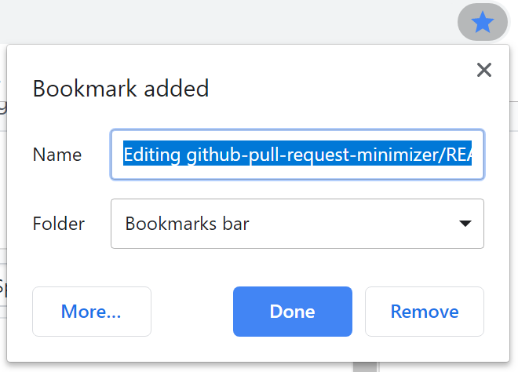
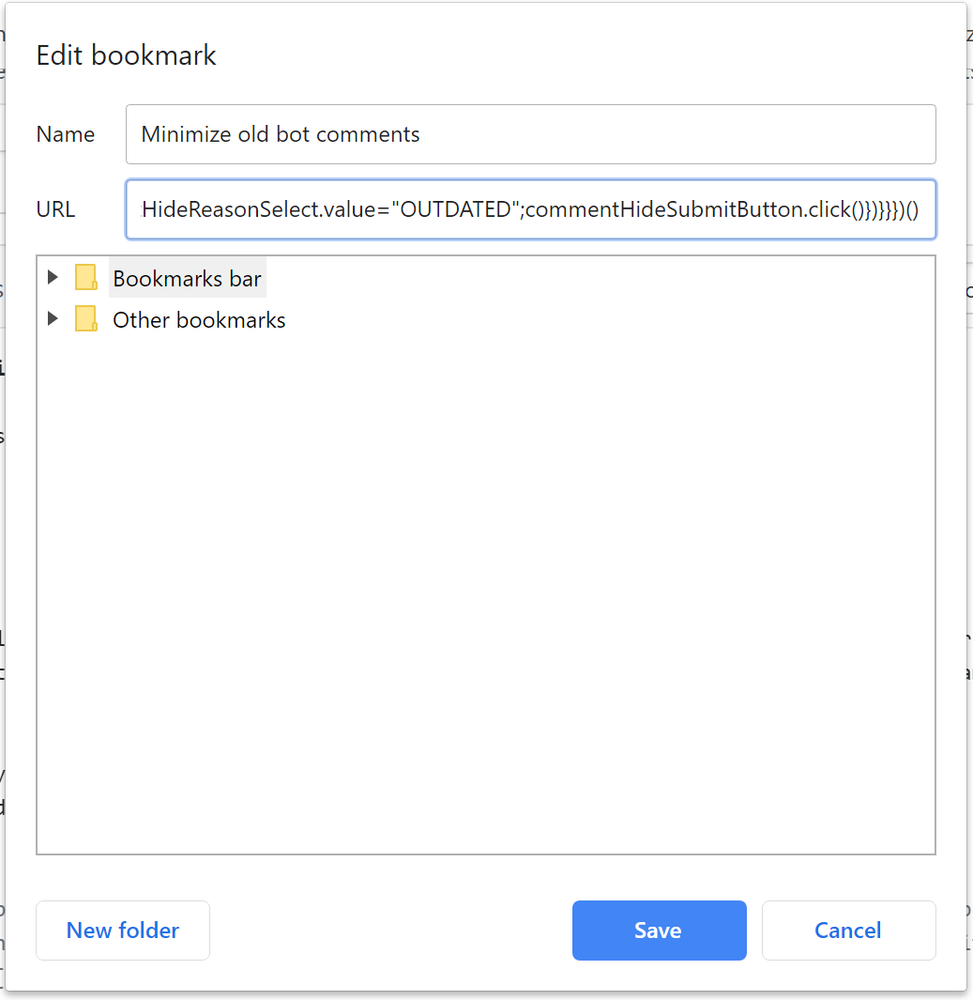

# GitHub pull request comment minimizer

Minimize GitHub comment noise in your pull requests from bots using this Google Chrome extension.

## Current state

### v0.1.0: Bookmarklet

A proof-of-concept was developed that works when executed in the browser developer tools console. If you really needed this functionality in its current form, it could be encapsulated into a bookmarklet like this. (Edit the bot name prefixes in the resulting JavaScript first, though.)

1. Create a bookmark for any page, even this one.
1. Find the new bookmark and edit it. If you just bookmarked this page in Chrome, click the **More...** button to edit the bookmark address.

    

1. Inside the bookmark edit pop-up, set the address to this large block of JavaScript. (It's ugly, but that's how bookmarklets often look.)

```js
javascript:(function(){let botNamePrefixes=["opbld","PRMerger","acrolinxatmsft"];if(!Array.prototype.groupBy){Array.prototype.groupBy=function(keyDefiner){return this.reduce(function(store,item){let key=keyDefiner(item);let value=store[key]||[];store[key]=value.concat([item]);return store},{})}}
let groupedItemsToProcess=[...document.querySelectorAll(".js-comment-hide-button")].map((button)=>{let timelineItem=button.closest(".js-timeline-item");return{timelineItem:timelineItem,commentHideButton:button,foundAuthorPrefix:(()=>{let isTimelineItemAlreadyHidden=[...timelineItem.getElementsByClassName("minimized-comment")].some(element=>element.offsetWidth>0&&element.offsetHeight>0);if(isTimelineItemAlreadyHidden){return null}
let author=timelineItem.getElementsByClassName("author")[0].innerText;let foundBotNamePrefix=botNamePrefixes.find(botNamePrefix=>author.startsWith(botNamePrefix));if(!foundBotNamePrefix){return null}
return foundBotNamePrefix})(),itemDate:(()=>{return Date.parse(timelineItem.getElementsByClassName("js-timestamp")[0].getElementsByTagName("relative-time")[0].getAttribute("datetime"))})()}}).filter((historyItem)=>historyItem.foundAuthorPrefix!==null).groupBy((historyItem)=>historyItem.foundAuthorPrefix);for(var itemGroup in groupedItemsToProcess){if(groupedItemsToProcess.hasOwnProperty(itemGroup)){let sortedItemsWithoutNewest=[...groupedItemsToProcess[itemGroup]].sort(function(a,b){a.itemDate-b.itemDate}).slice(0,-1);sortedItemsWithoutNewest.forEach(itemToHide=>{let commentHideForm=itemToHide.timelineItem.getElementsByClassName("js-comment-minimize")[0];let commentHideReasonSelect=[...commentHideForm.getElementsByTagName("select")].filter(e=>e.getAttribute("name")==="classifier")[0];let commentHideSubmitButton=[...commentHideForm.getElementsByTagName("button")].filter(e=>e.classList.contains("btn")&&e.getAttribute("type")==="submit")[0];itemToHide.commentHideButton.click();commentHideReasonSelect.value="OUTDATED";commentHideSubmitButton.click()})}}})()
```

1. Name your bookmark something like `Minimize old bot comments`, so you can find it easily in your bookmarks.

    

1. Now, when you are viewing a GitHub pull request with lots of old bot comments, just click that bookmark you created. It will go through the page and submit the requests to mark all prior bot comments as hidden, with the reason "Outdated".

> [!NOTE]
> If you want to customize this script for your own bots, edit the `botNamePrefixes` variable at the beginning of the JavaScript block. It is currently set for the bots used in the Microsoft Docs build system (also used by Microsoft Learn).

## Roadmap

Here are the current plans for upcoming releases. These are definitely subject to change as this project develops or evolves.

### v0.2+: Chrome extension

* Host functionality in a new extension

### v0.3+: Customization

* Allow customization of excluded bots within extension
