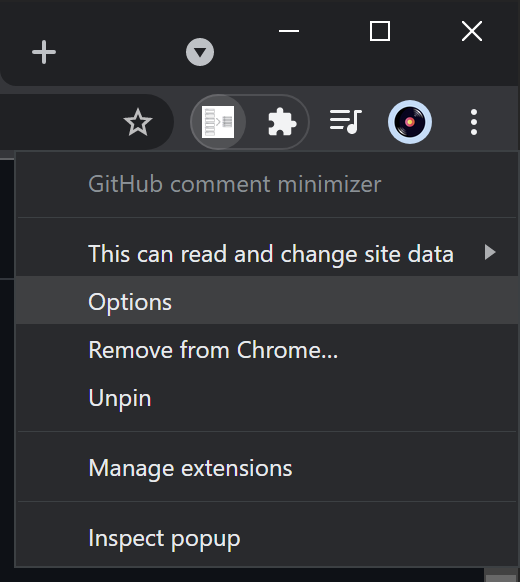
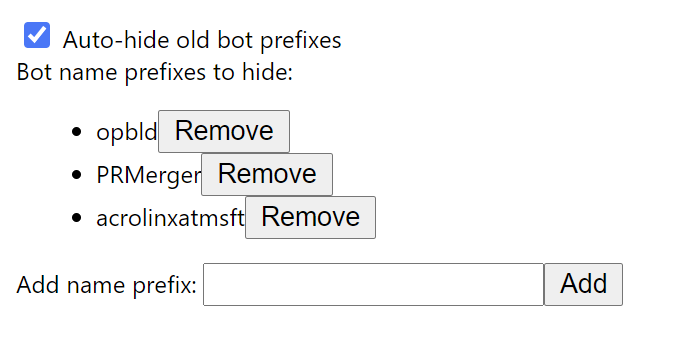

# GitHub pull request (PR) comment minimizer

Minimize GitHub comment noise in your pull requests from bots using this Google Chrome extension.

Reduce the noise of repetitive bot comments in your GitHub pull requests by visually hiding outdated comments, keeping the focus of your pull request conversation on contributor comments. This extension will leave the latest comment from any of the defined bots, but hide any older comments.

By default, the bot prefixes used are the most common ones found in MicrosoftDocs repos:

* **opbld**
* **PRMerger**
* **acrolinxatmsft**

You can change these to add new prefixes, remove existing ones, or replace the default list entirely.

> [!NOTE]
> Prior versions of this extension would allow for hiding comments permanently via an official GitHub mechanism. This required elevated permissions, restricting the usefulness. As of version 0.4.0, this extension will only hide comments visually within your browser. Nothing is persisted and will require the browser extension for anyone else to experience the comment hiding.

## How do I hide bot comments in a PR?

Once installed, when viewing any GitHub pull request, all eligible  bot comments will be hidden visually automatically when the page loads. Additionally, when expanding a large comment history, any newly shown eligible comments will be hidden. The eligibility of a comment is based on the prefix of the commenter's GitHub username. The extension will hide all but the newest comment from any given bot.

## How do I re-show hidden bot comments in a PR?

To re-show hidden comments, click the extension toolbar icon and click the **Reshow hidden comments** button. Any hidden comments will be restored visually again. Clicking the **Hide outdated for session** will hide those comments again.

## How do I customize which bot name prefixes are eligible to hide?

To customize the bot name prefixes you want to hide, you'll have to edit the prefixes in the extension options once it's installed.

1. Find the GitHub comment minimizer extension button in the Chrome/Edge toolbar.
1. Right-click the button and select **Options**.

    

To add a new prefix, use the textbox at the bottom of the options page and click **Add**. To remove an existing prefix, click the **Remove** button next to it.

Your bot prefix choices will sync to any other computers where you log in with the same browser account and install the GitHub comment minimizer extension.

## How do I disable the auto-hiding of comments when the page loads?

You can disable automatic hiding of eligible comments by toggling the auto-hide setting in the extension options.

1. Find the GitHub comment minimizer extension button in the Chrome/Edge toolbar.
1. Right-click the button and select **Options**.

    

To disable automatic hiding of outdated bot comments by unchecking the **Auto-hide old bot comments** option.

## Installation

If you are using Google Chrome or the Chromium-based Microsoft Edge, you can install the [GitHub comment minimizer extension](https://chrome.google.com/webstore/detail/microsoft-docslearn-githu/kcjgaccpjfoapcbaaecnjngjeccgmplh) to allow hiding old bot comments in your GitHub pull requests.

### Google Chrome

Installation on Google Chrome works as you would install any other Chrome extension found on the Chrome Web Store.

1. Visit the [Microsoft Docs/Learn GitHub comment minimizer extension page on the Chrome Web Store](https://chrome.google.com/webstore/detail/microsoft-learn-maintenan/kagphmnlicelfcbbhhmgjcpgnbponlda).
1. Click the **Add to Chrome** button on the extension page.
    
1. Confirm the extension install by clicking the **Add extension** button from the resulting pop-up.
    

### Microsoft Edge

For Microsoft Edge, you'll first need to allow installing extensions from other stores. You can do this from the extension page on the Chrome Web Store above. Edge will put a header in place to guide you to allow Chrome Web Store extensions.

1. Click the **Allow extensions from other stores** button from the header in Edge.
    
1. Confirm enabling other stores by clicking the **Allow** button from the resulting pop-up.
    

> [!NOTE]
> You can also toggle this setting from the **Extensions** page. Expand the left-hand menu, if needed, and toggle the **Allow extensions from other stores** option.

1. Visit the [Microsoft Docs/Learn GitHub comment minimizer extension page on the Chrome Web Store](https://chrome.google.com/webstore/detail/microsoft-learn-maintenan/kagphmnlicelfcbbhhmgjcpgnbponlda).
1. Click the **Add to Chrome** button on the extension page.
1. Confirm the extension install by clicking the **Add extension** button from the resulting pop-up.
    
