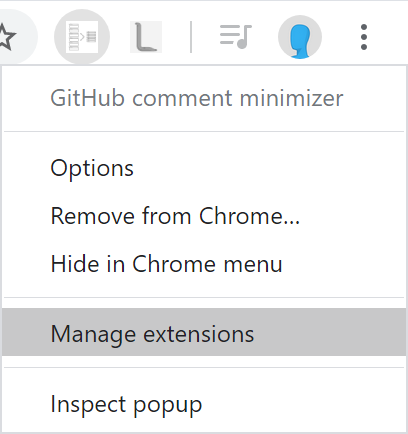
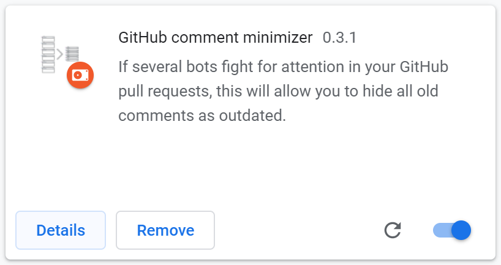
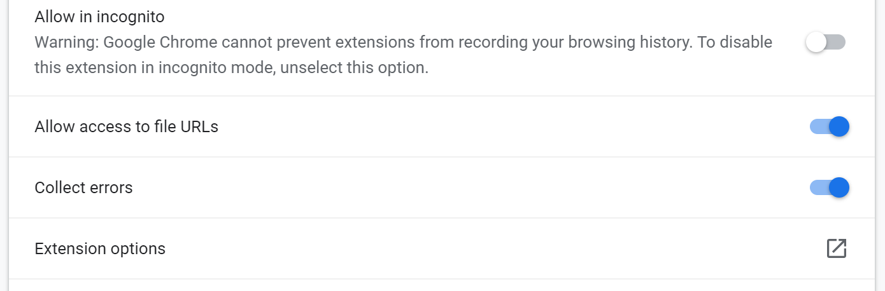

# GitHub pull request comment minimizer

Minimize GitHub comment noise in your pull requests from bots using this Google Chrome extension.

Reduce the noise of repetitive bot comments in your GitHub pull requests by hiding outdated comments, keeping the focus of your pull request conversation on your contributors.

Once installed, from any GitHub pull request (currently limited to MicrosoftDocs repo bots), click the toolbar icon and select "Hide outdated bot comments". The extension will leave the latest comment from any of the defined bots, but hide any older comments.

If you ever hide a comment you need shown, you can always click "Show comment" to restore its visibility.

## Installation

If you are using Google Chrome or the Chromium-based Microsoft Edge, you can install the [GitHub comment minimizer extension](https://chrome.google.com/webstore/detail/microsoft-docslearn-githu/kcjgaccpjfoapcbaaecnjngjeccgmplh) to allow hiding old bot comments in your GitHub pull requests.

### Google Chrome

Installation on Google Chrome works as you would install any other Chrome extension found on the Chrome Web Store.

1. Visit the [Microsoft Docs/Learn GitHub comment minimizer extension page on the Chrome Web Store](https://chrome.google.com/webstore/detail/microsoft-learn-maintenan/kagphmnlicelfcbbhhmgjcpgnbponlda).
1. Click the **Add to Chrome** button on the extension page.
    
1. Confirm the extension install by clicking the **Add extension** button from the resulting pop-up.
    

### Microsoft Edge

For Microsoft Edge, you'll first need to allow installing extensions from other stores. You can do this from the extension page on the Chrome Web Store above. Edge will put a header in place to guide you to allow Chrome Web Store extensions.

1. Click the **Allow extensions from other stores** button from the header in Edge.
    
1. Confirm enabling other stores by clicking the **Allow** button from the resulting pop-up.
    

> [!NOTE]
> You can also toggle this setting from the **Extensions** page. Expand the left-hand menu, if needed, and toggle the **Allow extensions from other stores** option.

1. Visit the [Microsoft Docs/Learn GitHub comment minimizer extension page on the Chrome Web Store](https://chrome.google.com/webstore/detail/microsoft-learn-maintenan/kagphmnlicelfcbbhhmgjcpgnbponlda).
1. Click the **Add to Chrome** button on the extension page.
1. Confirm the extension install by clicking the **Add extension** button from the resulting pop-up.
    

## Bot name prefixes

As of v0.3.0, you can customize the bot name prefixes used to identify outdated comments that need to be hidden.

By default, the bot prefixes used are the most common ones found in MicrosoftDocs repos:

* `opbld`
* `PRMerger`
* `acrolinxatmsft`

You can change these to add new prefixes, remove existing ones, or replace the default list entirely.

### Customize with your own bot name prefixes

To customize the bot name prefixes you want to hide, you'll have to edit them in the options for this extension once it's installed.

1. Open the **Extensions** window in Chrome. You can get there from the top-right Chrome menu, navigating to **More tools** > **Extensions**. Or, you can right click any extension icon in the Chrome toolbar and select **Manage extensions**.

    

1. In the **Extensions** window, find the **GitHub comment minimizer** extension and click the **Details** button.

    

1. Scroll down on the extension details and click the **Extension options** entry to open a new page for editing the bot name prefixes used by the extension.

    

To add a new prefix, use the textbox at the bottom of the options page and click **Add**. To remove an existing prefix, click the **Remove** button next to it.

Your bot prefix choices will sync to any other computers where you log in with the same browser account and install the GitHub comment minimizer extension.

## Roadmap

Here are the current plans for upcoming releases. These are definitely subject to change as this project develops or evolves.

### v0.3+: Customization

* Allow customization of excluded bots within extension
